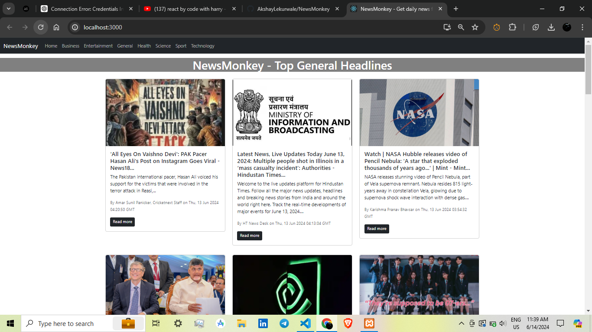
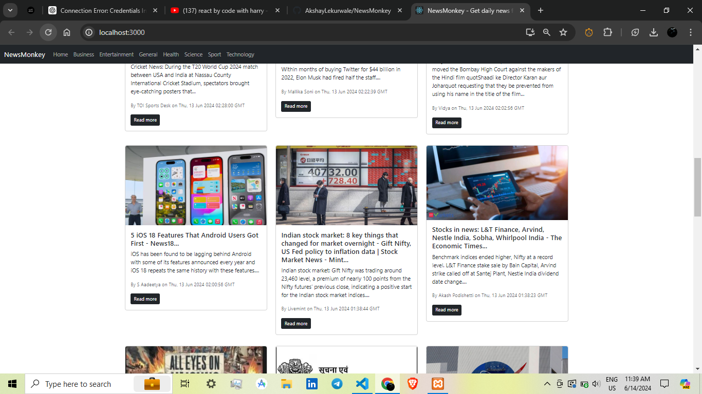
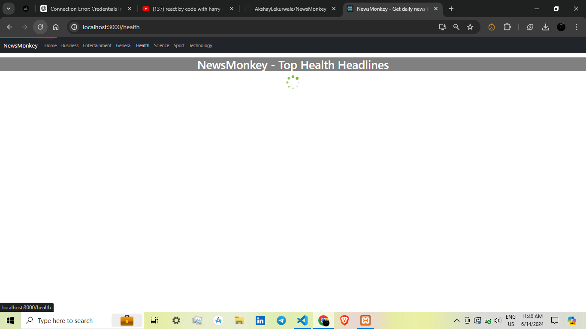
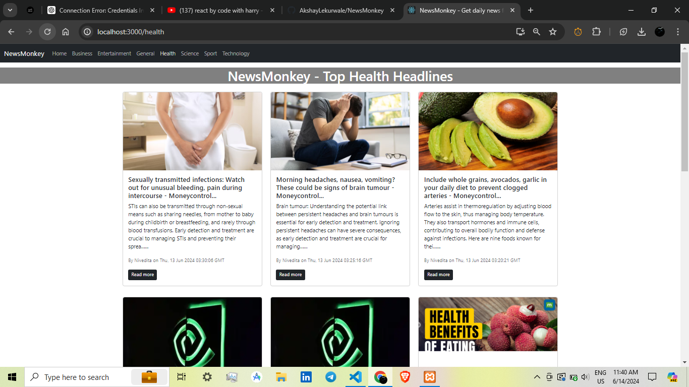

# NewsMonkey

NewsMonkey is a web-based news application that provides users with the latest news across various categories. This project is built using the MERN stack (React, Node.js) and showcases key features such as data fetching from APIs, implementing loaders, and using React Router for navigation.

## Features

- **Multiple News Categories**: Users can browse news articles from different categories including General, Sports, Entertainment, Health, Business, and Technology.
- **Dynamic Data Fetching**: The app fetches real-time news data from external APIs, ensuring that users always have access to the latest news.
- **Loading Indicators**: Implemented loaders to enhance user experience by providing visual feedback while data is being fetched.
- **Smooth Navigation**: Utilized React Router for seamless navigation between different news categories.
- **Responsive Design**: The application is designed to be responsive, ensuring a smooth experience on both desktop and mobile devices.

## Technologies Used

- **Frontend**: React.js, React Router
- **API**: News data is fetched from a third-party news API

## Learning Outcomes

By building NewsMonkey, I have gained hands-on experience in:

- **Fetching Data from APIs**: Understanding how to make API calls and handle asynchronous data fetching in a React application.
- **Implementing Loaders**: Learning to enhance user experience with loading indicators during data fetching operations.
- **React Router**: Mastering the use of React Router for creating a multi-page experience in a single-page application (SPA).
- **MERN Stack**: Strengthening my skills in full-stack development using MongoDB, Express.js, React, and Node.js.

